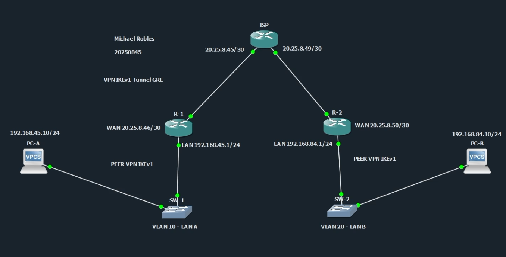
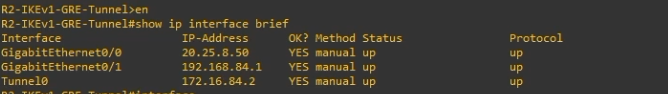
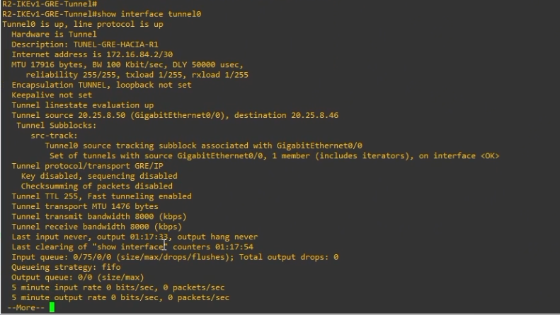
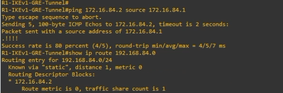
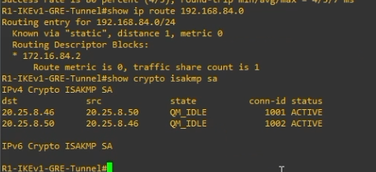
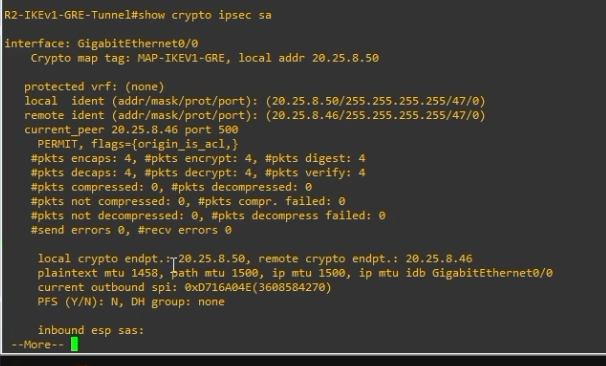
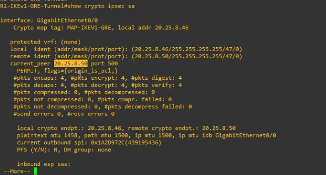
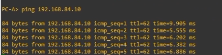
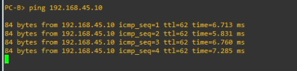

# VPN IPSec IKEv1 Site-to-Site con Túnel GRE


---

## Información del proyecto

**Autor:** Michael David Robles Fermín  

**Matrícula:** 2025-0845  

**Asignatura:** Seguridad de Redes  

**Repositorio:** https://github.com/iClexi/VPN-IKEv1-Tunnel-GRE  

**Video demostrativo:**  
https://youtu.be/opI3pn_s4aI  

**Documentación técnica profesional:**  
[Ver documentación técnica profesional](docs/Documentacion%20Tecnica%20Profesional.pdf)  

**Ubicación directa:** `docs/Documentacion Tecnica Profesional.pdf`

---

## Vista general de la topología

La práctica fue desarrollada en GNS3 utilizando una topología Site-to-Site punto a punto. El diseño mantiene dos redes LAN separadas, un router en cada extremo y un router ISP funcionando como red intermedia.

```text
PC-A --- SW1 --- R1 --- ISP --- R2 --- SW2 --- PC-B
```



En esta topología, **R1** y **R2** son los routers peers que establecen el túnel GRE y la protección IPSec. El router **ISP** solamente permite conectividad entre las interfaces WAN de R1 y R2. El ISP no participa en la negociación IKEv1, no cifra tráfico y no tiene configuración de VPN.

---

## Descripción general

Este repositorio contiene la configuración, evidencias y documentación de una **VPN IPSec IKEv1 Site-to-Site con túnel GRE**.

La finalidad del laboratorio es permitir la comunicación entre dos redes LAN diferentes:

```text
LAN A: 192.168.45.0/24
LAN B: 192.168.84.0/24
```

Para lograr esto se configuró un túnel GRE entre R1 y R2. Luego ese túnel GRE fue protegido con IPSec utilizando IKEv1.

La idea principal de esta práctica es:

```text
GRE crea el túnel.
IPSec protege el túnel.
IKEv1 negocia la seguridad de IPSec.
```

GRE permite crear un enlace lógico entre los routers, pero por sí solo no cifra el tráfico. Por esa razón se combina con IPSec, para que el tráfico GRE que viaja entre las WAN de R1 y R2 quede protegido.

---

## Objetivo del laboratorio

El objetivo principal de este laboratorio es configurar y validar una VPN Site-to-Site punto a punto utilizando un túnel GRE protegido con IPSec IKEv1.

Para cumplir esto se implementó:

- Una topología con dos routers peers.
- Un router ISP como red intermedia.
- Una LAN en cada extremo.
- Un túnel GRE entre R1 y R2.
- Direccionamiento lógico para la interfaz Tunnel0.
- Rutas estáticas hacia las redes remotas por medio del túnel GRE.
- IKEv1 para la negociación de seguridad.
- IPSec para proteger el tráfico GRE.
- Crypto map aplicado en la interfaz WAN.
- Pruebas de conectividad entre PC-A y PC-B.
- Verificación del túnel, de IKEv1 y de IPSec mediante comandos show.

---

## Conceptos utilizados

### VPN

Una VPN, o red privada virtual, permite establecer comunicación segura entre dos puntos a través de una red que no necesariamente es confiable. En este laboratorio, la red intermedia está representada por el router ISP.

La VPN permite que la LAN A y la LAN B se comuniquen como si estuvieran conectadas de forma privada, aunque el tráfico atraviese una red intermedia.

### VPN Site-to-Site

Una VPN Site-to-Site conecta redes completas entre sí. En este caso, no se conecta un solo cliente remoto, sino dos redes LAN completas:

```text
LAN A detrás de R1
LAN B detrás de R2
```

Esto simula un escenario donde dos sucursales de una empresa necesitan comunicarse de forma segura.

### GRE

GRE significa Generic Routing Encapsulation. Es un protocolo que permite crear un túnel lógico entre dos routers.

En esta práctica, GRE se usa para crear la interfaz `Tunnel0` entre R1 y R2:

```text
R1 Tunnel0: 172.16.84.1/30
R2 Tunnel0: 172.16.84.2/30
```

GRE permite transportar tráfico entre redes remotas usando una ruta hacia el túnel. Sin embargo, GRE no cifra el tráfico. Por eso se protege con IPSec.

### IPSec

IPSec es el conjunto de protocolos encargado de proteger el tráfico IP mediante cifrado, autenticación e integridad.

En esta práctica, IPSec no protege directamente una ACL entre LAN A y LAN B. En este caso, IPSec protege el tráfico GRE entre las IP WAN de los routers:

```text
R1 WAN: 20.25.8.46
R2 WAN: 20.25.8.50
```

Esto significa que el tráfico de las LANs viaja dentro de GRE, y GRE viaja protegido por IPSec.

### IKEv1

IKEv1 se encarga de negociar los parámetros de seguridad entre R1 y R2 antes de que IPSec pueda proteger el tráfico.

En esta práctica se utilizó:

- AES 256 para cifrado.
- SHA para integridad.
- Autenticación por clave precompartida.
- Diffie-Hellman grupo 14.
- Lifetime de 86400 segundos.

Cuando la negociación funciona correctamente, el estado esperado es:

```text
QM_IDLE ACTIVE
```

---

## Comparación con los modos anteriores

Antes de esta práctica se realizaron dos diseños: **Policy-Based** y **Route-Based**. Esta tercera práctica utiliza **GRE + IPSec**, por lo que es importante diferenciar los tres modelos.

### VPN Policy-Based

En la VPN Policy-Based, el tráfico protegido se selecciona directamente con una ACL entre las LANs. Esa ACL se amarra a un crypto map, y el crypto map se aplica en la interfaz WAN.

```text
Policy-Based = ACL entre LANs + Crypto Map
```

En ese modo no se usa `Tunnel0`. El tráfico se cifra si coincide con la ACL de tráfico interesante.

### VPN Route-Based

En la VPN Route-Based se crea una interfaz virtual tipo VTI. IPSec se aplica directamente al túnel mediante un IPSec profile, y las rutas estáticas mandan el tráfico hacia la red remota por esa interfaz.

```text
Route-Based = Tunnel0 VTI + IPSec Profile + Rutas
```

En ese modo no se usa GRE. El túnel ya es IPSec directamente.

### VPN con Túnel GRE

En esta práctica se usa una interfaz `Tunnel0`, pero el túnel es GRE. El tráfico entra al túnel mediante rutas, y luego IPSec protege ese tráfico GRE entre las WAN.

```text
Tunnel GRE = Tunnel0 GRE + Rutas + Crypto Map protegiendo GRE
```

La diferencia principal es que aquí GRE crea el túnel, e IPSec cifra el tráfico GRE. En la salida de `show crypto ipsec sa`, el tráfico protegido aparece como protocolo `47`, que corresponde a GRE.

---

## Direccionamiento IP

| Dispositivo | Interfaz | Dirección IP | Función |
|---|---|---|---|
| PC-A | e0 | 192.168.45.10/24 | Host de la LAN A |
| R1 | Gi0/1 | 192.168.45.1/24 | Gateway de la LAN A |
| R1 | Gi0/0 | 20.25.8.46/30 | WAN hacia ISP |
| R1 | Tunnel0 | 172.16.84.1/30 | Extremo local del túnel GRE |
| ISP | Gi0/0 | 20.25.8.45/30 | Enlace hacia R1 |
| ISP | Gi0/1 | 20.25.8.49/30 | Enlace hacia R2 |
| R2 | Gi0/0 | 20.25.8.50/30 | WAN hacia ISP |
| R2 | Gi0/1 | 192.168.84.1/24 | Gateway de la LAN B |
| R2 | Tunnel0 | 172.16.84.2/30 | Extremo remoto del túnel GRE |
| PC-B | e0 | 192.168.84.10/24 | Host de la LAN B |

La red `172.16.84.0/30` se utiliza únicamente para el túnel GRE. No pertenece a la LAN A, no pertenece a la LAN B y tampoco pertenece a la red del ISP. Su función es permitir que R1 y R2 tengan un enlace lógico punto a punto.

---

## VLANs utilizadas

Aunque la VPN se configura en los routers, los switches mantienen separadas las redes locales mediante VLANs.

| Switch | VLAN | Nombre | Uso |
|---|---:|---|---|
| SW1 | 10 | LAN_A | Segmento local del sitio A |
| SW2 | 20 | LAN_B | Segmento local del sitio B |

SW1 conecta la PC-A con R1 en la VLAN 10. SW2 conecta la PC-B con R2 en la VLAN 20.

---

## Parámetros usados

| Parámetro | Valor usado | Descripción |
|---|---|---|
| Tipo de VPN | IPSec Site-to-Site | VPN entre dos sitios remotos |
| Diseño | GRE + IPSec | GRE crea el túnel e IPSec lo protege |
| Versión IKE | IKEv1 | Negociación ISAKMP clásica |
| Autenticación | Pre-Shared Key | Ambos peers usan la misma clave |
| Clave | ITLA20250845 | Clave compartida entre R1 y R2 |
| Cifrado IKE | AES-256 | Cifrado para la negociación IKEv1 |
| Hash | SHA | Integridad de la fase IKE |
| Diffie-Hellman | Grupo 14 | Intercambio seguro de llaves |
| Lifetime | 86400 segundos | Tiempo de vida de la política ISAKMP |
| Túnel | GRE | Túnel lógico entre R1 y R2 |
| Red GRE | 172.16.84.0/30 | Red lógica del túnel |
| Transform-set | TS-IKEV1-GRE | Conjunto de transformaciones IPSec |
| IPSec | ESP-AES 256 / ESP-SHA-HMAC | Cifrado e integridad del tráfico protegido |
| Modo IPSec | Transport | Protege el tráfico GRE entre las WAN |
| ACL | 120 | Identifica el tráfico GRE protegido |
| Crypto map | MAP-IKEV1-GRE | Aplica IPSec sobre la interfaz WAN |

---

## Tráfico protegido por IPSec

En esta práctica, IPSec protege el tráfico GRE entre las interfaces WAN de los routers.

| Router | ACL | Tráfico protegido |
|---|---:|---|
| R1 | 120 | permit gre host 20.25.8.46 host 20.25.8.50 |
| R2 | 120 | permit gre host 20.25.8.50 host 20.25.8.46 |

Esto es diferente a la VPN Policy-Based. En la VPN Policy-Based la ACL protegía directamente el tráfico entre LAN A y LAN B. En esta VPN, la ACL protege GRE entre las WAN. Dentro de ese GRE viaja el tráfico real de las LANs.

---

## Estructura del repositorio

```text
VPN-IKEv1-Tunnel-GRE/
├── docs/
│   └── Documentacion Tecnica Profesional.pdf
├── images/
│   ├── MichaelRobles_2025-0845_01-Topologia-General-VPN-IKEv1-Tunnel-GRE_P3.png
│   ├── MichaelRobles_2025-0845_02-R2-Show-IP-Interface-Brief_P3.png
│   ├── MichaelRobles_2025-0845_03-R2-Show-Interface-Tunnel0_P3.png
│   ├── MichaelRobles_2025-0845_04-R1-Ping-Tunnel-y-Route-LAN-B_P3.png
│   ├── MichaelRobles_2025-0845_05-R1-Show-Crypto-ISAKMP-SA_P3.png
│   ├── MichaelRobles_2025-0845_06-R2-Show-Crypto-IPSec-SA_P3.png
│   ├── MichaelRobles_2025-0845_07-R1-Show-Crypto-IPSec-SA_P3.png
│   ├── MichaelRobles_2025-0845_08-PC-A-Ping-PC-B_P3.png
│   └── MichaelRobles_2025-0845_09-PC-B-Ping-PC-A_P3.png
├── scripts/
│   ├── R1-IKEv1-GRE-Tunnel.cfg
│   ├── R2-IKEv1-GRE-Tunnel.cfg
│   ├── ISP.cfg
│   ├── SW1.cfg
│   ├── SW2.cfg
│   ├── PC-A.cfg
│   ├── PC-B.cfg
│   └── Verification-Commands.txt
├── video/
│   └── Video-Link.txt
└── README.md
```

---

## Tutorial de configuración

Esta sección explica cómo se configuró el laboratorio y qué función cumple cada bloque principal.

### 1. Configuración básica de R1

Primero se configuró el nombre del router y se desactivó la búsqueda DNS automática:

```cisco
hostname R1-IKEv1-GRE-Tunnel
no ip domain-lookup
```

El comando `hostname` permite identificar el router dentro del laboratorio. El comando `no ip domain-lookup` evita que el router intente resolver como dominio un comando escrito de forma incorrecta.

---

### 2. Configuración de la interfaz WAN de R1

La interfaz WAN de R1 conecta hacia el ISP:

```cisco
interface GigabitEthernet0/0
 description WAN-HACIA-ISP-G0/0
 ip address 20.25.8.46 255.255.255.252
 no shutdown
```

Esta interfaz usa la IP `20.25.8.46/30`. Esa dirección es importante porque funciona como origen real del túnel GRE y como endpoint local para IPSec.

---

### 3. Configuración de la interfaz LAN de R1

La interfaz LAN de R1 conecta hacia SW1 y funciona como gateway de PC-A:

```cisco
interface GigabitEthernet0/1
 description LAN-A-HACIA-SW1-G0/0
 ip address 192.168.45.1 255.255.255.0
 no shutdown
```

PC-A usa `192.168.45.1` como puerta de enlace para comunicarse con la LAN B.

---

### 4. Ruta por defecto hacia el ISP

R1 necesita una ruta por defecto para poder alcanzar la WAN de R2 a través del ISP:

```cisco
ip route 0.0.0.0 0.0.0.0 20.25.8.45
```

Sin esta ruta, R1 no tendría forma de llegar a `20.25.8.50`, que es la IP WAN de R2.

---

### 5. Configuración del túnel GRE en R1

El túnel GRE se configuró en la interfaz `Tunnel0`:

```cisco
interface Tunnel0
 description TUNEL-GRE-HACIA-R2
 ip address 172.16.84.1 255.255.255.252
 tunnel source GigabitEthernet0/0
 tunnel destination 20.25.8.50
 tunnel mode gre ip
 no shutdown
```

La IP `172.16.84.1/30` identifica a R1 dentro del túnel GRE.

El comando `tunnel source GigabitEthernet0/0` indica que el túnel sale por la WAN de R1.

El comando `tunnel destination 20.25.8.50` indica que el túnel termina en la WAN de R2.

El comando `tunnel mode gre ip` especifica que el túnel será GRE sobre IPv4.

---

### 6. Ruta hacia la LAN B por el túnel GRE

Para que R1 pueda llegar a la LAN B, se configuró una ruta estática hacia el extremo remoto del túnel:

```cisco
ip route 192.168.84.0 255.255.255.0 172.16.84.2
```

Esta ruta indica que todo el tráfico destinado a `192.168.84.0/24` debe enviarse hacia `172.16.84.2`, que es el Tunnel0 de R2.

---

### 7. Configuración de IKEv1

En R1 se configuró una política IKEv1:

```cisco
crypto isakmp policy 10
 encr aes 256
 hash sha
 authentication pre-share
 group 14
 lifetime 86400
```

Este bloque define los parámetros de seguridad usados para la negociación:

- `encr aes 256`: usa AES de 256 bits para cifrado.
- `hash sha`: usa SHA para integridad.
- `authentication pre-share`: usa clave precompartida.
- `group 14`: usa Diffie-Hellman grupo 14.
- `lifetime 86400`: define el tiempo de vida de la negociación.

---

### 8. Clave precompartida

La clave precompartida se configuró apuntando hacia la WAN de R2:

```cisco
crypto isakmp key ITLA20250845 address 20.25.8.50
```

La misma clave debe existir en R2 apuntando hacia la WAN de R1. Si la clave no coincide, IKEv1 no levanta correctamente.

---

### 9. Transform-set IPSec

El transform-set define cómo IPSec protegerá el tráfico:

```cisco
crypto ipsec transform-set TS-IKEV1-GRE esp-aes 256 esp-sha-hmac
 mode transport
```

Se usa `mode transport` porque IPSec está protegiendo tráfico GRE entre dos endpoints WAN. GRE ya encapsula el tráfico de las LANs, e IPSec protege ese paquete GRE.

---

### 10. ACL para proteger GRE

La ACL 120 identifica el tráfico GRE que debe ser protegido por IPSec:

```cisco
access-list 120 remark PROTEGER_TRAFICO_GRE_ENTRE_R1_Y_R2
access-list 120 permit gre host 20.25.8.46 host 20.25.8.50
```

Esta ACL no selecciona directamente `192.168.45.0/24` hacia `192.168.84.0/24`. En esta práctica, la ACL selecciona GRE entre `20.25.8.46` y `20.25.8.50`.

---

### 11. Crypto map para proteger GRE

El crypto map une el peer remoto, el transform-set y la ACL 120:

```cisco
crypto map MAP-IKEV1-GRE 10 ipsec-isakmp
 description IPSEC-PROTEGIENDO-GRE-HACIA-R2
 set peer 20.25.8.50
 set transform-set TS-IKEV1-GRE
 match address 120
```

Este crypto map indica que el tráfico GRE identificado por la ACL 120 será protegido con IPSec hacia el peer `20.25.8.50`.

---

### 12. Aplicación del crypto map en la WAN

Finalmente, el crypto map se aplicó en la interfaz WAN:

```cisco
interface GigabitEthernet0/0
 crypto map MAP-IKEV1-GRE
```

Esto es obligatorio porque el tráfico GRE sale por la interfaz WAN de R1. Si el crypto map no se aplica en la WAN, IPSec no protege el túnel.

---

## Explicación de los scripts

### R1-IKEv1-GRE-Tunnel.cfg

Este script configura a R1 como peer principal de la VPN GRE sobre IPSec.

En R1 se configura:

- Interfaz WAN hacia el ISP.
- Interfaz LAN hacia SW1.
- Ruta por defecto hacia el ISP.
- Interfaz `Tunnel0` en modo GRE.
- Ruta hacia la LAN B por el túnel GRE.
- Política IKEv1.
- Clave precompartida hacia R2.
- Transform-set IPSec en modo transport.
- ACL 120 para proteger tráfico GRE.
- Crypto map aplicado en la WAN.

### R2-IKEv1-GRE-Tunnel.cfg

Este script configura a R2 como el segundo peer de la VPN.

En R2 se usa la misma lógica que en R1, pero en sentido contrario. R2 usa `172.16.84.2/30` en Tunnel0, apunta su túnel hacia `20.25.8.46` y enruta la LAN A por `172.16.84.1`.

### ISP.cfg

El ISP solo tiene direccionamiento en sus interfaces:

```text
20.25.8.45/30 hacia R1
20.25.8.49/30 hacia R2
```

No tiene configuración IKEv1, IPSec ni GRE. Su función es simular la red intermedia.

### SW1.cfg y SW2.cfg

SW1 contiene la VLAN 10 para la LAN A. SW2 contiene la VLAN 20 para la LAN B. Ambos switches trabajan como switches de acceso.

### PC-A.cfg y PC-B.cfg

PC-A utiliza la IP `192.168.45.10/24` con gateway `192.168.45.1`.

PC-B utiliza la IP `192.168.84.10/24` con gateway `192.168.84.1`.

Estas PCs se usan para validar la comunicación entre ambas LANs.

---

## Funcionamiento técnico

El funcionamiento general es el siguiente:

1. PC-A intenta comunicarse con PC-B.
2. El tráfico llega a R1.
3. R1 revisa su tabla de rutas.
4. R1 encuentra que la LAN B `192.168.84.0/24` se alcanza por `172.16.84.2`.
5. El tráfico entra al túnel GRE.
6. GRE encapsula el tráfico original.
7. IPSec identifica el tráfico GRE entre `20.25.8.46` y `20.25.8.50`.
8. IKEv1 negocia la seguridad entre R1 y R2.
9. IPSec cifra el tráfico GRE.
10. El tráfico viaja protegido a través del ISP.
11. R2 recibe el tráfico, lo descifra, lo desencapsula y lo entrega a PC-B.
12. La respuesta de PC-B vuelve por el mismo proceso en sentido contrario.

---

## Evidencias

### Topología general


La topología muestra los dos peers VPN, el router ISP y una LAN en cada extremo.

### Interfaces de R2



Se observa que R2 tiene activas la interfaz WAN `20.25.8.50`, la interfaz LAN `192.168.84.1` y la interfaz `Tunnel0` con la IP `172.16.84.2`.

### Tunnel0 en R2



Esta evidencia confirma que `Tunnel0` está en estado `up/up`, usando GRE/IP como protocolo de túnel. También se observa que el origen del túnel es `20.25.8.50` y el destino es `20.25.8.46`.

### Ping del túnel y ruta hacia LAN B



La prueba de ping hacia `172.16.84.2` confirma conectividad entre los extremos del túnel GRE. La ruta hacia `192.168.84.0/24` muestra que R1 envía el tráfico de la LAN B por el túnel.

### IKEv1 levantado



El estado `QM_IDLE ACTIVE` confirma que IKEv1 negoció correctamente entre R1 y R2.

### IPSec en R2



En R2 se observan contadores de IPSec activos. También se evidencia que el tráfico protegido utiliza protocolo `47`, correspondiente a GRE.

### IPSec en R1



En R1 también se observan contadores de encapsulación, cifrado, desencapsulación y descifrado. Esto confirma que IPSec está protegiendo el tráfico GRE.

### Ping PC-A hacia PC-B



La prueba confirma conectividad desde la LAN A hacia la LAN B.

### Ping PC-B hacia PC-A



La prueba confirma conectividad en sentido contrario, desde la LAN B hacia la LAN A.

---

## Comandos de verificación

### Verificación de interfaces

```cisco
show ip interface brief
show interface tunnel0
```

### Verificación del túnel GRE

```cisco
ping 172.16.84.2 source 172.16.84.1
ping 172.16.84.1 source 172.16.84.2
```

### Verificación de rutas

```cisco
show ip route 192.168.84.0
show ip route 192.168.45.0
```

### Verificación de IKEv1

```cisco
show crypto isakmp sa
```

Resultado esperado:

```text
QM_IDLE ACTIVE
```

### Verificación de IPSec

```cisco
show crypto ipsec sa
```

Contadores esperados:

```text
#pkts encaps
#pkts encrypt
#pkts decaps
#pkts decrypt
```

También debe observarse el protocolo `47`, que representa GRE.

### Verificación de conectividad entre LANs

```bash
PC-A> ping 192.168.84.10
PC-B> ping 192.168.45.10
```

---

## Resultado esperado

El resultado esperado del laboratorio es que:

- `Tunnel0` aparezca en estado `up/up`.
- El ping entre `172.16.84.1` y `172.16.84.2` responda.
- Las rutas hacia las LAN remotas apunten al túnel GRE.
- `show crypto isakmp sa` muestre `QM_IDLE ACTIVE`.
- `show crypto ipsec sa` muestre contadores mayores que cero.
- El tráfico protegido aparezca como GRE, protocolo `47`.
- PC-A pueda hacer ping a PC-B.
- PC-B pueda hacer ping a PC-A.

---

## Documentación técnica profesional

La documentación completa está disponible en el siguiente enlace interno del repositorio:

[Ver documentación técnica profesional](docs/Documentacion%20Tecnica%20Profesional.pdf)

También se encuentra directamente en la siguiente ubicación dentro del repositorio:

```text
docs/Documentacion Tecnica Profesional.pdf
```

---

## Conclusión

La VPN IPSec IKEv1 Site-to-Site con túnel GRE fue configurada correctamente. R1 y R2 establecieron un túnel GRE usando las interfaces `Tunnel0`, y ese tráfico GRE fue protegido mediante IPSec con IKEv1.

Las evidencias muestran que el túnel GRE quedó en estado `up/up`, que IKEv1 alcanzó el estado `QM_IDLE ACTIVE`, que IPSec cifró tráfico GRE y que PC-A y PC-B lograron comunicarse correctamente.

Con esto se confirma que GRE creó el túnel lógico entre ambos sitios, mientras que IPSec aseguró la comunicación a través de la red intermedia representada por el ISP.
